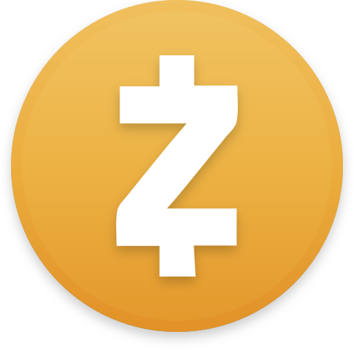
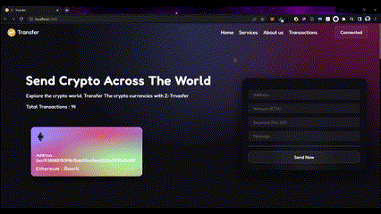

# Project Title


It is a Web application that facilitates the exchange of cryptocurrencies in an easy and interactive manner through the use of Giphy Api

## Overview




## Authors

- [@Zeel Rabadiya](https://www.github.com/l33Z)

## Run Locally

Clone the project

```bash
  git clone https://link-to-project
```

Go to the project directory

```bash
  cd Z-Transfer
```

Install dependencies

```bash
  npm install
```

Go to client directory

```bash
  cd client
```
Install dependencies

```bash
  npm install
```
Start the server
```bash
  npm run dev
```
**Make Sure You Are Connected To Goerli Testnetwork To Metamask**


## Tech Stack

**Client:** React, ReactDom, ether.js

**Blockchain:** Goerli, Infura, Truffle, Solidity


